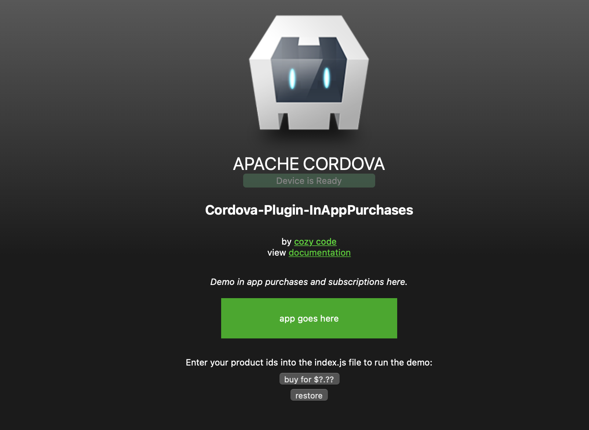

# [cozycode.ca](https://cozycode.ca)

### Make apps with HTML, CSS, and JavaScript:
  * [make apps with JavaScript](https://cozycode.ca/posts?pon=make-an-app-with-cordova)
  * [how to make an in-app purchases with Cordova](https://cozycode.ca/posts?pon=cordova-plugin-inapppurchases)
  * [a testing app for in-app purchases](https://cozycode.ca/posts?pon=cordova-plugin-inapppurchases_TESTAPP)
  * [a demo app for in-app purchases](https://cozycode.ca/posts?pon=cordova-plugin-inapppurchases_DEMOAPP)

### Get in-app purchases and subscriptions with a plugin:
```properties
cordova plugin add cordova-plugin-inapppurchases
```
Repository: [cordova-plugin-inapppurchases on github](https://github.com/cozycodegh/cordova-plugin-inapppurchases)
<p align="center">
Test and demo apps:
</p>
<p align="center">
<a href="https://github.com/cozycodegh/cordova-plugin-inapppurchases_TESTAPP"></a>
<a href="https://github.com/cozycodegh/cordova-plugin-inapppurchases_DEMOAPP"></a>
</p>

<p align="center">
Enjoy!
</p>
