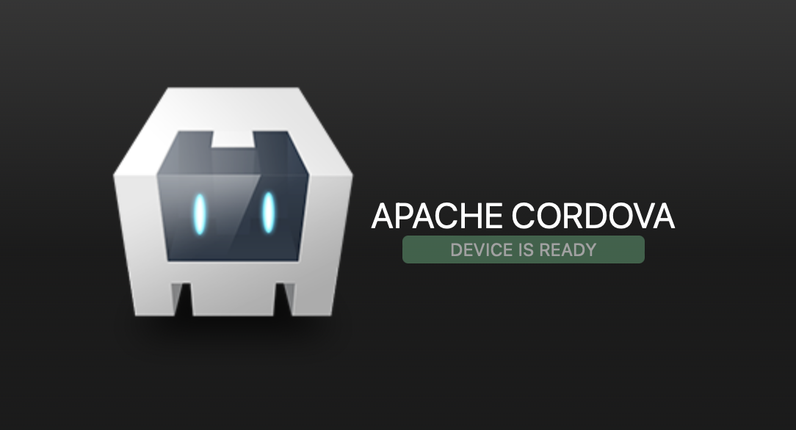

# Create an App For the App Store with JavaScript

It is wondeful to be able to make whole apps to sell on the app store using only HTML, JavaScript, and CSS. It's cross-platform, meaning it can be sold on for Android on the Google Play Store and for iOS on Apple's App Store.

HTML, JavaScript, and CSS are very powerful to make great looking apps with a lot of functionality.

To make an app, install [`cordova`](https://cordova.apache.org/) for command line.

```properties
sudo npm install -g cordova
```

It's good to have a terminal like bash to work in. If you have `Linux` or `MacOS`, you can use the `terminal`. If you have `Windows`, you could make dual boot of Linux, like Ubuntu, or use `node.js command prompt`. [`Nodejs`](https://nodejs.org/en/) and [`npm`](https://www.npmjs.com) are both likely needed to install cordova.

Create an app using a cordova command:
```properties
cordova create new_app_directory com.name_or_company.my_new_app_id MyAppName 
```
Come up with a an app_id and an app name and enter them in.

Now you have a cross-platform app!

To see your app, add a platform. <br/>
The main platforms supported by cordova in 2023 are `ios`, `android`, `browser`, and `electron`. <br/>
Run this command to add a platform to your app:
```properties
cordova platform add browser
```

You can run it in a browser:
```properties
cordova platform run browser
```

Here's the app to start on!
<p align="center">

</p>

To view the app on an Android device, follow the set up instructions [from Cordova here](https://cordova.apache.org/docs/en/11.x/guide/platforms/android/index.html) to download [Android Studio](https://developer.android.com/studio/index.html), set up an [Android Virtual Device](https://developer.android.com/studio/run/managing-avds.html) if you don't have an Android device. Install all of the command line tools to run your app with a cordova command:
```properties
cordova run --device android
```

To view the app on an iOS device, install [Xcode](
https://developer.apple.com/xcode/) from a computer running MacOS. Follow the [iOS cordova install steps](https://cordova.apache.org/docs/en/11.x/guide/platforms/ios/index.html) to install command line tools and run with a cordova command:
```properties
cordova run ios
```

Cordova allows third-party plugins, for example, to get in-app purchases working from your app, there is a [plugin](https://github.com/cozycodegh/cordova-plugin-inapppurchases) for that. To add plugins use the cordova plugin command:
```
cordova plugin add cordova-plugin-inapppurchases
```
Cordova has [plugins](https://cordova.apache.org/plugins/) for working with device capabilities like the camera or battery status.

More from [cozycode.ca](https://cozycode.ca):  
  * [how to make an in-app purchases with cordova](https://cozycode.ca/posts?pon=cordova-plugin-inapppurchases)
  * [a testing app for in-app purchases](https://cozycode.ca/posts?pon=cordova-plugin-inapppurchases_TESTAPP)
  * [a demo app for in-app purchases](https://cozycode.ca/posts?pon=cordova-plugin-inapppurchases_DEMOAPP)
